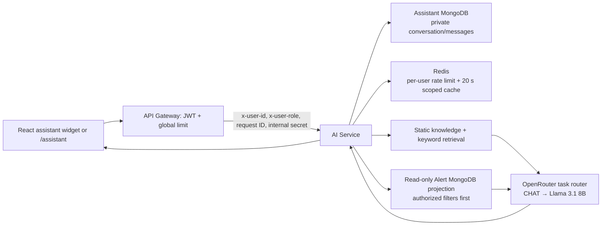

# EcoAlert AI Assistant

## Purpose and operating boundary

EcoAlert AI Assistant is a read-only, role-aware guide for authenticated users. It can explain the platform and summarize only dynamic data for which the current user is authorized. It cannot submit or change reports, assign officers, resolve incidents, modify users, or send notifications. When a user asks for a write action, it explains the workflow and returns the relevant in-app link instead.

## Request flow



The browser never calls an LLM provider. The API gateway authenticates the request; then the AI service validates the forwarded user context and, in production, requires the configured `INTERNAL_GATEWAY_SHARED_SECRET`. Keep the AI service private to the Docker network so identity headers cannot be supplied directly by an untrusted client.

## API contract

All routes are gateway routes under `/api/v1/assistant` and require a normal EcoAlert bearer token. Internally, the proxy rewrites the path to `/assistant` in the AI service.

| Method | Gateway route | Purpose |
| --- | --- | --- |
| `GET` | `/conversations` | List the current user's most recent conversations (max 30). |
| `POST` | `/conversations` | Create an empty assistant conversation; optional `{ "title": "..." }`. |
| `GET` | `/conversations/:id/messages` | Read messages only if the conversation belongs to the requester. |
| `POST` | `/messages` | Send `{ "message": "...", "conversationId": "optional" }` and receive the created conversation plus assistant message. |

Messages are plain text, limited to 2,000 characters. Responses use the standard EcoAlert envelope and return a `sources` array. Source links are rendered as in-app citations, not trusted model-generated HTML.

## Persistence schemas

`assistant_conversations`:

- `userId` (indexed), `role`, `title`, `lastMessageAt`, `createdAt`, `updatedAt`
- compound index: `{ userId, lastMessageAt }`

`assistant_messages`:

- `conversationId` (indexed), `userId` (indexed), `role` (`USER` or `ASSISTANT`), bounded `content`, `sources`, optional `provider` and `model`, timestamps
- compound index: `{ conversationId, createdAt }`

Every conversation and message query includes `userId`. A guessed conversation ID returns `404`, so it does not reveal another user's history.

## RAG and controlled read-only tools

The initial knowledge base is maintained in `backend/ai-service/src/assistant/knowledge.ts`. Chunks have a stable source ID, title, in-app link, role scope, and keywords. The retriever tokenizes the question, scores matching keywords, and returns only the top permitted chunks. This is deliberately behind a narrow retriever interface so an embedding/vector implementation can later replace it without changing the routes or UI.

Dynamic lookup is deterministic rather than model-selected. The only allowed tools are:

| Tool | Roles | Data scope |
| --- | --- | --- |
| `incident_status` | Citizen, Officer, Admin | Citizen: `citizenId`; officer: `assignedOfficerId`; admin: all non-deleted reports. |
| `officer_assigned_tasks` | Officer | `assignedOfficerId` only. |
| `admin_system_overview` | Admin | Aggregate counts by incident status; no user profile data. |

The service uses a Mongo projection limited to title, status, severity, timestamps, and the ownership/assignment fields required for filtering. It never sends images, raw evidence, descriptions, contact information, or arbitrary collections to the model.

## Role behaviour

- Citizen: reporting guidance, status meaning, and their own report summaries.
- Officer: assigned-task and resolution-workflow guidance; only assigned incident summaries.
- Admin: operational guidance and authorized aggregate overview; administrative write actions remain unavailable through chat.

The frontend only changes suggestions and navigation by role. The AI service repeats the role validation and applies the scope filters; UI state is never treated as authorization.

## Redis keys and limits

| Key | TTL | Purpose |
| --- | --- | --- |
| `assistant:rate:v1:{userId}` | `ASSISTANT_RATE_WINDOW_SECONDS` (60 by default) | Allows up to `ASSISTANT_RATE_LIMIT` (20 by default) messages per user per window. |
| `assistant:context:v1:{role}:{userId}:{intent}:{record}` | 20 seconds | Private short-lived cache for authorized dynamic context. |

Rate limiting fails closed if Redis is unavailable, returning a user-safe retry message. Context caching is best-effort; cache failures do not broaden access or cache a response for another user.

## Task-specific OpenRouter routing

The AI Service owns one OpenAI-compatible OpenRouter client and selects the model deterministically per request:

| Task | Model variable | Intended model | Input |
| --- | --- | --- | --- |
| `INCIDENT_ANALYSIS` | `OPENROUTER_ANALYSIS_MODEL` | `openai/gpt-4o-mini` | Incident text and optional evidence image |
| `CHAT` | `OPENROUTER_CHAT_MODEL` | `meta-llama/llama-3.1-8b-instruct` | Text-only authorized Assistant context |

The frontend never receives the provider credential and never calls OpenRouter. Incident analysis and Assistant chat use the same `OPENROUTER_API_KEY`, but the model is selected per task and is not configured permanently on the shared client.

The incident flow remains: Citizen report → Alert Service → `alert.created` RabbitMQ event → AI Service → structured OpenRouter result → `image.analyzed` event → Alert Service persistence. The Assistant keeps the same role-aware retrieval, scoped data access, history, and read-only behavior.

## Provider configuration

Use `backend/ai-service/.env.example` as the service template. Do not commit populated secret files.

| Variable | Required | Notes |
| --- | --- | --- |
| `MONGO_URI` | yes | Assistant conversations/messages database. |
| `ALERT_MONGO_URI` | yes | Alert service database, used only through the narrow read model. |
| `REDIS_URL` | yes | Required rate limiter/cache. |
| `INTERNAL_GATEWAY_SHARED_SECRET` | production | Same non-empty secret in gateway and AI service. |
| `OPENROUTER_API_KEY` | yes | One secret shared by both AI tasks. Store only in the deployment secret manager or AI Service `.env`. |
| `OPENROUTER_BASE_URL` | optional | Defaults to `https://openrouter.ai/api/v1`. |
| `OPENROUTER_ANALYSIS_MODEL` | yes | Incident and optional vision-analysis model. |
| `OPENROUTER_CHAT_MODEL` | yes | Text-only Assistant model. |
| `OPENROUTER_SITE_URL` | optional | OpenRouter attribution URL. |
| `OPENROUTER_APP_NAME` | optional | OpenRouter attribution title. |
| `OPENROUTER_MODEL` | migration only | Deprecated fallback for either missing task-specific model; a startup warning is emitted once. |
| `OPENROUTER_ANALYSIS_FALLBACK_MODEL` | optional/reserved | Parsed for future temporary-provider fallback; automatic fallback is not enabled. |
| `OPENROUTER_CHAT_FALLBACK_MODEL` | optional/reserved | Parsed for future temporary-provider fallback; automatic fallback is not enabled. |

Assistant provider timeouts/errors still return the safe grounded response and never surface upstream error details or keys. Missing credentials or missing task models fail AI Service startup clearly instead of silently disabling model-backed behavior.

## Deployment notes

1. Add `MONGO_URI_AI`, `OPENROUTER_API_KEY`, both task-specific model variables, and `INTERNAL_GATEWAY_SHARED_SECRET` to the deployment secret store.
2. The supplied Docker Compose file wires gateway-to-AI discovery with `AI_SERVICE_URL=http://ai-service:3005`; do not publish port 3005 publicly.
3. Apply Mongo backups and retention policy for assistant history. Add a user-facing retention/deletion policy before production rollout.
4. Monitor gateway 401/429/5xx responses, OpenRouter latency/token usage by task and model, Redis availability, and Mongo query latency. Do not log message bodies, bearer tokens, or provider credentials.
5. For scale, move static chunks into a managed knowledge collection and replace `retrieveKnowledge` with an embedding/vector implementation while preserving source IDs and role filtering.

## Verification

```powershell
cd backend/ai-service
npm install
npm test

cd ../..
docker compose config --quiet
docker compose up -d --build --force-recreate ai-service

# Prints only key presence and non-secret model names.
docker compose exec ai-service node -e "console.log({hasKey:Boolean(process.env.OPENROUTER_API_KEY),analysisModel:process.env.OPENROUTER_ANALYSIS_MODEL,chatModel:process.env.OPENROUTER_CHAT_MODEL})"

cd frontend
npm run build
```

Manual checks should include one user of each role, a citizen attempting to reference another user's alert ID, a direct call to the private AI service without the gateway secret in production, message rate exhaustion, and a configured-provider outage. In every case, confirm that no unauthorized incident details or provider errors are returned.
