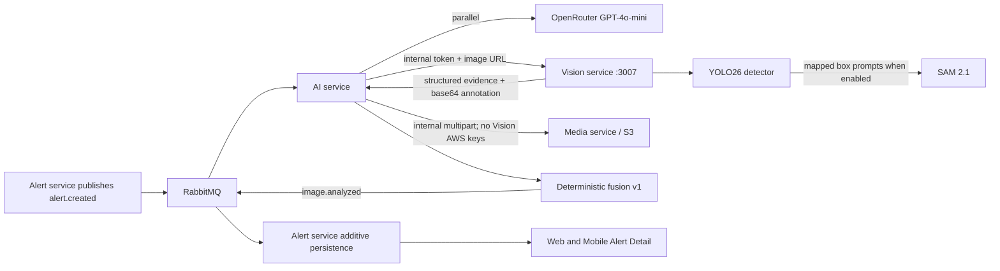

# Phase 1: Multimodal Environmental Vision Intelligence

## Scope and operational truth

Phase 1 augments the existing GPT-4o-mini incident analysis. It does not replace the semantic pipeline, make enforcement decisions, or claim a production-quality waste classifier.

- Detector: Ultralytics `yolo26n.pt`, runtime pinned to `ultralytics==8.4.102`.
- Detector weights: pretrained COCO baseline. COCO has 80 general object classes and no EcoAlert waste taxonomy. Only `bottle` and `cup` are conservatively tagged as potential litter with waste type `OTHER`; custom labels use the explicit mapping in `app/models.py`.
- Segmenter: Meta SAM 2.1 tiny, source pinned to commit `2b90b9f5ceec907a1c18123530e92e794ad901a4` with config `configs/sam2.1/sam2.1_hiera_t.yaml`.
- SAM prompting: detector boxes for detections that have a mapped potential waste type. SAM does not supply a calibrated waste-class confidence; `segmentationConfidence` is therefore always `null`.
- Coverage: union of segmentation mask pixels divided by image pixels. When SAM is disabled or unavailable, coverage is `null`; bounding-box area is never used as a substitute.
- Custom weights/dataset: not present. `training/` is scaffolding only.

Official references: [Ultralytics YOLO26](https://docs.ultralytics.com/models/yolo26), [Ultralytics package](https://pypi.org/project/ultralytics/), and [Meta SAM 2](https://github.com/facebookresearch/sam2).

## Architecture and ownership



The Vision service is internal-only in Compose (`expose`, no host `ports`). The Media service remains the only owner of S3 credentials. AI removes annotation base64 before publishing RabbitMQ data.

## Rollout and rollback

Both flags default to false:

```dotenv
VISION_AI_ENABLED=false
VISION_SEGMENTATION_ENABLED=false
```

1. Deploy with both false. Existing GPT-only output and old records are unchanged.
2. Set `VISION_AI_ENABLED=true` for detection plus fusion. Leave segmentation false until the SAM checkpoint is mounted and health reports it loaded.
3. Set `VISION_SEGMENTATION_ENABLED=true`, place `sam2.1_hiera_tiny.pt` in the `vision_model_cache` volume, and restart Vision/AI.
4. Roll back instantly by setting `VISION_AI_ENABLED=false`; no schema rollback is required because all fields are optional and additive.

`VISION_MODEL_EAGER_LOAD=false` avoids model download/load during a disabled rollout. The first enabled request calls the one-time registry loader. Set it true for fail-fast warm startup once artifacts are provisioned.

`VISION_DEVICE=auto` selects CUDA when the installed Torch build exposes it and otherwise selects CPU. The default Compose build uses CPU Torch for broad compatibility. Build a GPU image explicitly with an approved PyTorch CUDA wheel index, for example `VISION_TORCH_INDEX_URL=https://download.pytorch.org/whl/cu124`; the host driver/runtime must also be configured separately.

## Internal API

`POST /internal/v1/analyze`

Header:

```text
x-internal-service-token: <INTERNAL_GATEWAY_SHARED_SECRET>
```

Request:

```json
{
  "imageUrl": "https://configured-bucket.s3.region.amazonaws.com/ecoalert/alerts/example.jpg",
  "incidentId": "optional-alert-id",
  "segmentationEnabled": false
}
```

Response fields include exact detections (`classId`, label, confidence, pixel and normalized boxes), sorted object counts, exact total count, detector confidence, nullable union-mask coverage, nullable segmentation confidence, model names, processing time, warnings, and an internal base64 JPEG annotation. AI uploads the JPEG through `POST /internal/vision-upload`; only the resulting URL is persisted.

Health is available at `GET /health`. `degraded` means the detector is not yet loaded; it does not expose exception messages or credentials.

Errors:

- `401`: missing or invalid internal token.
- `400`: malformed/disallowed URL, DNS failure, blocked private address, redirect, download failure, or invalid/decompression-bomb image.
- `413`: response exceeds the byte limit.
- `415`: response is not an image.
- `503`: detector unavailable.

## Security controls

- Exact hostname allowlist from `VISION_ALLOWED_IMAGE_HOSTS`; URL credentials and non-HTTP(S) schemes are rejected.
- DNS results must be globally routable unless an explicit local-development override is enabled.
- Redirects are disabled to prevent allowlist bypass.
- Streaming byte limit (10 MB default), decoded-pixel limit (25 MP default), HTTP timeout, and content-type validation.
- One worker and an application semaphore bound CPU/RAM concurrency. Increase only after load testing.
- Constant-time internal-token comparison. The shared token is supplied at runtime, never committed.
- Logs include model/status metadata but not image bytes, signed query strings, tokens, AWS keys, or provider keys.

For stricter production isolation, add egress policy permitting only the configured object-storage endpoint and pin/checksum model artifacts in an internal registry.

## Deterministic fusion v1

Severity uses an auditable 0–100 score:

| Evidence | Score |
|---|---:|
| Semantic low / medium / high / critical | 15 / 40 / 65 / 90 |
| Segmented coverage ≥10% / ≥25% / ≥50% | +3 / +6 / +10 |
| Detected objects ≥3 / ≥10 / ≥20 | +2 / +5 / +8 |
| Explicit custom hazardous-waste class | +10 |

Final bands are low 0–24, medium 25–49, high 50–74, and critical 75–100. Every applied factor and explanation is persisted. Semantic severity is the floor; vision evidence can escalate, not silently downgrade it.

Confidence remains separated:

- `semanticConfidence`: GPT’s value.
- `visionConfidence`: mean YOLO box confidence, or null when there are no detections.
- `segmentationConfidence`: null because SAM masks are not calibrated waste probabilities.
- `fusionConfidence`: semantic confidence weighted 85%, detector confidence weighted 15% and capped at 0.75 for the COCO baseline. Vision-only confidence is capped at 0.60, preventing auto-verification by the existing >0.85 rule.

Modes:

- `FULL_MULTIMODAL`: both branches succeeded.
- `SEMANTIC_ONLY`: GPT succeeded and Vision failed or had no image.
- `VISION_ONLY`: Vision succeeded and GPT failed; category is conservatively `other`, copy explicitly requires human review, and confidence is capped.
- Both failed: no completion event is published; the existing RabbitMQ rejection behavior remains visible operationally.

When the feature flag is false, old `text`, `vision`, or `text_fallback` modes remain untouched.

## Additive Alert fields

Existing fields remain the semantic-compatible summary. Optional additions are:

- `aiPipelineVersion`
- `aiVision`: status, exact detections/counts, models, dimensions, nullable coverage/confidences, annotation URL, latency, warnings
- `aiFusion`: mode, potential waste type, severity score/factors/explanations, three separated confidence values
- timing: semantic provider, YOLO detection, SAM segmentation, annotation, deterministic fusion, and total pipeline milliseconds
- feedback-ready fields: `aiVerified`, `aiVerifiedBy`, `aiVerifiedAt`, `aiHumanCorrection`

No migration is necessary for existing MongoDB documents. Older clients ignore the additions; updated Web/Mobile cards render only when evidence exists and fetch the annotated image only after the user taps View.

## Model provisioning

No model artifact is committed. Run the explicit script inside a built image with the named volume mounted:

```powershell
docker compose build vision-service
docker run --rm -v ecoalert_vision_model_cache:/models ecoalert-vision-service:latest python /app/scripts/download_models.py --yolo --sam2
```

Compose-generated image names vary by project name; obtain the exact name with `docker compose images vision-service`. The script prints the SAM checkpoint SHA-256. Record and approve that digest before production use.

## Validation commands

```powershell
docker build --target test -t ecoalert-vision-test backend/vision-service
docker run --rm ecoalert-vision-test
npm test --prefix backend/ai-service
npm test --prefix backend/alert-service
npm run build --prefix frontend
npx tsc --noEmit --project mobile/tsconfig.json
docker compose config
docker compose up -d --build vision-service ai-service alert-service media-service
docker compose exec vision-service python -c "import urllib.request; print(urllib.request.urlopen('http://localhost:3007/health').read().decode())"
```

Manual acceptance:

1. Confirm disabled flags yield the legacy GPT-only event.
2. Enable detection, submit a valid S3-hosted incident image, and verify exact counts/boxes plus an S3 annotation URL.
3. Confirm Web, citizen Mobile, and officer Mobile show the compact card; annotation is absent from network activity before View is pressed.
4. Test disallowed hosts, redirects, oversized and corrupt images; GPT must still persist `SEMANTIC_ONLY`.
5. Stop OpenRouter access while Vision is healthy and verify cautious `VISION_ONLY`; stop both and verify no false completion.
6. Enable SAM only after mounting its checkpoint; verify coverage is mask-union coverage and overlapping masks are counted once.

## Performance and limitations

This repository host has no detected CUDA/NVIDIA runtime. CPU is functional but expected to be materially slower than GPU; first-request latency also includes lazy model download/load if weights were not provisioned. Do not publish latency SLOs until the evaluation template records p50/p95/p99 on the deployment hardware. As an initial planning range—not a benchmark—YOLO nano can take hundreds of milliseconds to several seconds per image on CPU, while SAM 2.1 can add multiple seconds and substantial RAM.

Key limitations are COCO/waste domain mismatch, object-state ambiguity (a bottle is not necessarily litter), photo framing and occlusion, tiny/distant objects, poor lighting, SAM dependence on detector boxes, no temporal/multi-image fusion, and no production dataset validation. The output is explainable triage evidence, not environmental, legal, or safety adjudication.

## Licensing and privacy

Review licenses before commercial deployment: Ultralytics offers AGPL-3.0 and enterprise terms; Meta SAM 2 has its own repository license and checkpoint terms. This document is not legal advice. Incident photos may contain faces, plates, homes, location metadata, or minors. Apply least-privilege retention, access logging, deletion propagation, regional storage rules, and dataset opt-out/consent processes before using reports for training.
